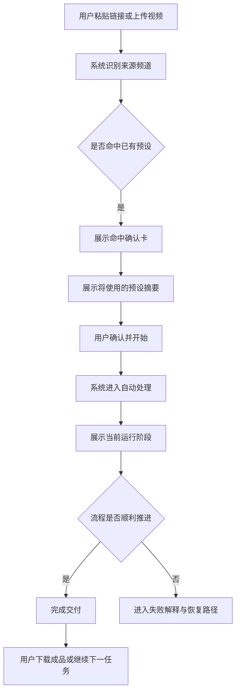
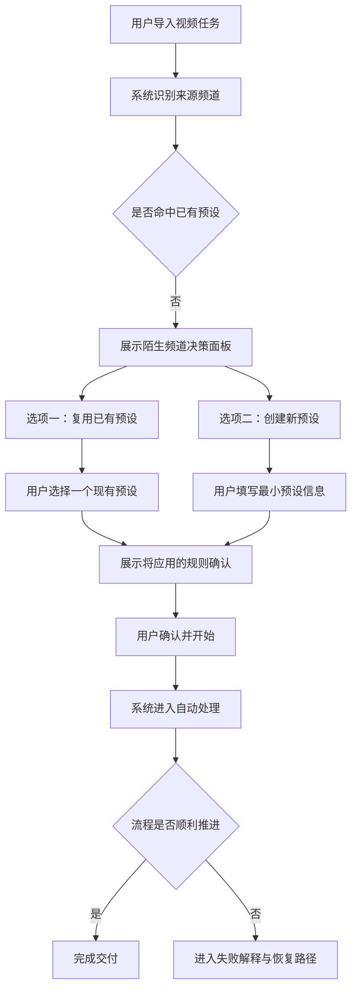
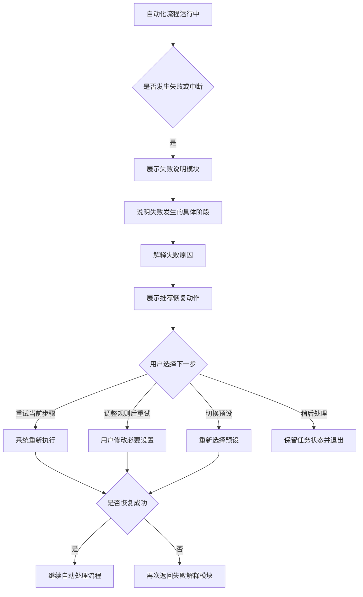

# UX Design Specification Yakimoji

**Author:** 季悠然
**Date:** 2026-05-19

---

<!-- UX design content will be appended sequentially through collaborative workflow steps -->

## Executive Summary

### Project Vision

Yakimoji 是一个面向高频汉化型个人创作者的频道预设工作台，目标不是单次完成视频翻译，而是把用户原本在本地手动执行的转录、翻译与烤制流程沉淀为可复用的默认规则资产。产品的核心价值，在于当用户导入任务后，系统能够基于来源频道自动命中并执行既有预设，从而尽量减少重复配置和启动摩擦，让任务更快进入可交付状态。

第一阶段的 UX 不应围绕“编辑能力有多强”展开，而应围绕“默认决策是否足够可信、任务是否能快速开工、异常是否只在必要时出现”展开。产品应让用户感受到自己不是在重新配置一个复杂工具，而是在继续一条已经被系统记住的工作流。

### Target Users

Yakimoji 的首要目标用户是高频汉化型个人创作者，尤其是那些持续处理固定来源频道内容的一人内容工厂。这类用户通常已经具备成熟的手动工作流，会在本地完成转录、翻译和视频烤制，但他们最大的痛点并不是不会处理视频，而是每次都要重新执行相似的配置和判断。

他们希望把这些重复决策沉淀为预设，并在后续任务中由系统自动完成大部分流程。对他们而言，最有价值的体验不是更多编辑自由，而是更少重复劳动、更短启动路径和更稳定的交付节奏。使用场景以桌面端为主，但移动端也需要支持轻量创建任务，以及任务查看、跟进和必要确认。

### Key Design Challenges

Yakimoji 的第一项关键设计挑战，是如何把“自动命中并执行预设”设计成既高效又可信的体验。用户需要明显感受到系统已经替自己做了大部分决策，同时又不会因为自动化而失去掌控感。

第二项关键挑战，是如何处理陌生频道首次出现的场景。对于未命中预设的任务，系统不应把用户拉入复杂后台，而应提供足够轻的决策路径，让用户可以手动选择复用已有预设，或者直接创建一个新的最小预设，再继续当前任务。

第三项关键挑战，是如何控制第一阶段范围，让产品保持工作台属性而不是滑向重编辑器。复杂字幕样式设置不应在第一阶段进入主路径，否则会显著增加任务创建复杂度，并削弱“少打扰、快速开工”的核心体验。与此同时，移动端还需支持轻量创建任务，这要求信息架构在缩减后仍保留关键动作完整性。

### Design Opportunities

Yakimoji 最大的设计机会，是把任务创建入口做成一次明确的价值展示，让用户在导入来源后立刻感受到“系统知道我通常怎么处理这个频道”。这会成为产品区别于传统本地手工流程和通用翻译工具的核心 UX 时刻。

第二个机会，是把陌生频道处理从“异常”转化为“轻量资产沉淀入口”。如果用户能快速决定复用其他预设，或创建一个新预设并继续任务，那么原本打断流程的场景就会变成推动长期复用的关键节点。

第三个机会，是通过克制、编辑感强、秩序感明确的界面表达，建立一种熟练工工作台的产品气质。视觉和交互应共同强化产品的可信度、低打扰感和长期使用意愿，而不是走向功能堆叠或后台化表达。

## Core User Experience

### Defining Experience

Yakimoji 的核心用户动作，是导入一个新视频任务，并让它尽快进入自动处理。对用户来说，最频繁、最关键、也最应该被设计到几乎零摩擦的交互，就是任务导入本身。无论是粘贴来源链接还是拖拽上传文件，系统都应尽可能快地把用户从“我有一个视频要处理”带到“这个任务已经可以开跑”。

但 Yakimoji 的核心体验不止是快速导入，更是“导入后不再反复介入”。一旦用户选定预设，系统应自动完成从下载视频、转录、翻译、烤录到输出成品的整条链路。也就是说，导入是最重要的入口动作，而自动化跑完整个流程，则是最重要的价值兑现动作。

从 UX 角度看，Yakimoji 的定义不是一个功能繁杂的视频处理后台，而是一个让用户把既有工作流沉淀成默认规则，并在后续任务中稳定复用和自动执行的工作台。

### Platform Strategy

Yakimoji 第一阶段以 Web 为主，服务于高频创作者在桌面环境中的主工作流。桌面 Web 是核心平台，因为任务导入、预设配置、状态跟踪和结果下载等关键行为都更适合在鼠标键盘主导的环境中完成。第一阶段暂不需要独立移动 App。

移动端的定位不是完整复刻桌面工作台，而是提供轻量跟进能力。它应支持查看任务进度、接收通知、执行必要确认，并保留轻量创建任务的能力，以满足用户不在桌面前时的基本操作需求。

平台能力方面，第一阶段应优先支持拖拽上传和通知机制。拖拽上传可以降低任务导入摩擦，通知则可以在长链路自动处理完成或异常中断时及时把用户拉回关键节点。系统默认在线使用，不以离线能力为设计前提。

### Effortless Interactions

Yakimoji 最需要做到无感和顺手的交互，是任务导入。用户应能够快速粘贴链接或拖入视频文件，并在极短时间内进入下一步，而不是先面对复杂配置表单。导入动作应被压缩成一种接近“投递任务”的体验，而不是“创建项目”的体验。

第二个必须足够顺手的部分，是预设选定后的自动推进。一旦用户确认要使用某个预设，后续从下载视频到转录、翻译、烤录和成品交付的过程应尽量自动发生，除非遇到必要异常，否则不应要求用户频繁介入。产品应该让用户感受到：决定只做一次，执行由系统负责。

第三个需要被刻意简化的场景，是首次使用和预设建立。首次成功路径不应依赖系统一开始就自动识别一切，而应允许用户先手动创建一个预设，再去导入任务。这个过程必须足够轻，否则用户无法建立对后续自动化的信任。

### Critical Success Moments

Yakimoji 的首个关键成功时刻，不是用户第一次导入任务，而是第一次完整看到系统自动跑完一条流程，并成功交付成品。这是用户真正感受到“这比我现在手工流程更好”的瞬间，也是产品从工具尝试品转变为固定工作流入口的决定性时刻。

第二个关键时刻，是用户第一次创建预设时。这个过程如果足够轻、足够清楚，用户会理解产品的核心机制，并愿意继续把更多重复决策沉淀进去；如果这个过程显得复杂或像后台配置，用户很可能会在价值兑现前流失。

最不能失败的交互，是选定预设后的全自动处理链路。因为从下载视频到转录、翻译、烤录和成品交付的过程一旦失败，用户重新尝试的成本很高，且会直接削弱对整套系统的信任。这条链路不是普通功能点，而是整个体验的信用基础。

### Experience Principles

Yakimoji 的第一原则是“导入必须足够轻”。任务导入是产品最高频的入口动作，任何额外的配置负担都会直接削弱用户把它作为默认入口的意愿。

第二原则是“决定一次，系统执行到底”。用户应主要负责选择或确认预设，而不是在处理链路的每个阶段重复参与。只要预设已选定，后续流程就应默认自动推进。

第三原则是“首次建立信任，优先于首次展示智能”。第一阶段不必追求一开始就完美自动命中一切，而应优先确保用户能轻松创建第一个预设，并通过一次完整自动化跑通建立信任。

第四原则是“自动化链路是体验信用核心”。任务处理链路的稳定性不仅是技术问题，也是 UX 问题。对于高频创作者而言，只有当从下载视频到成品交付的全流程足够可靠，Yakimoji 才能被视为真正可依赖的工作台。

## Desired Emotional Response

### Primary Emotional Goals

Yakimoji 的首要情绪目标是让用户感到省心。它不应让用户在每次任务启动前重新组织思路、回忆配置或担心是否漏掉关键步骤，而应让用户逐步形成一种稳定预期：只要预设已经建立，系统就会替自己接管大部分重复工作。

第二层情绪目标是放心。对于高频创作者而言，真正决定是否长期使用的，不是系统是否看起来智能，而是是否值得信任。Yakimoji 应让用户感受到，这不是一个会频繁制造意外的自动化实验品，而是一个可以托付流程的可靠工作台。

第三层情绪目标是高效。高效不是单纯体现在速度数字上，而是体现在用户主观感受上：任务启动更快、重复劳动更少、处理中无需频繁盯守、完成后能够直接进入下一件事。这种效率感会成为用户愿意向朋友推荐产品的主要原因。

### Emotional Journey Mapping

用户第一次接触 Yakimoji 时，应该感受到它像一个可靠工作台，而不是一个复杂后台或炫技型 AI 产品。界面和交互都应传递出秩序感、稳定感和专业感，让用户在进入主流程前就建立基本信任。

在核心使用过程中，特别是任务已经导入并开始自动处理之后，用户应处于安心等结果的状态。系统不需要让用户持续参与，也不应制造不必要的注意力争夺，而应让用户明确知道流程正在推进，并相信系统会在关键时刻给出反馈。

当任务完成时，用户最理想的感受是“省心且放心”。不仅是事情做完了，更是自己没有被这条流程反复拖住，而且结果是可以依赖的。

当任务失败或中断时，系统应优先降低不确定感。用户不应只知道“失败了”，而应明确知道“为什么失败、卡在哪一步、接下来怎么办”。情绪上要避免挫败和顾虑持续累积，转而建立一种可解释、可恢复的体验预期。

当用户第二次、第三次回来使用时，理想感受应是“我可以很快开始一个流程”。这意味着 Yakimoji 应逐步从一个需要理解的新工具，转变为一个几乎不需要重新思考的固定入口。

### Micro-Emotions

在 Yakimoji 的情绪体验中，最关键的微情绪之一是清楚而不是困惑。用户需要始终知道自己当前在做什么、系统正在做什么，以及任务下一步将发生什么。任何模糊、跳跃或不透明的状态表达，都会直接伤害信任和效率感。

第二个关键微情绪是满足而不是失望。满足感并不来自复杂功能，而来自产品稳定兑现承诺：用户建立了预设，导入了任务，系统按预期把事情推进下去，并最终给出可交付结果。一次稳定兑现，比多个炫目功能更能建立长期使用意愿。

第三个关键微情绪是信任而不是怀疑。高频创作者会天然评估一个系统是否值得纳入日常工作流，而这种判断往往来自很多小信号，例如状态是否透明、失败是否可解释、默认值是否合理、操作是否可预期。Yakimoji 必须在这些细节上持续积累可信度。

### Design Implications

如果希望用户感到省心，任务创建与预设使用就必须足够克制。界面应减少无关配置、避免不必要分支，并优先呈现最能推动任务前进的信息与动作。UX 上应尽量把复杂性留在系统内部，而不是暴露给用户。

如果希望用户感到放心，系统必须清楚表达处理链路的状态、进展与结果，尤其是在失败场景中。失败提示不能停留在表面状态，而应说明失败原因、所处环节，以及用户可采取的下一步动作。可解释性本身就是情绪设计的一部分。

如果希望用户感到高效，交互就必须服务于快速开始和低打扰推进。导入应足够轻，预设命中应足够直接，处理中应避免频繁打断，通知应只在真正关键的节点出现。效率感不是靠压缩文字获得，而是靠减少决策摩擦和等待中的不确定性获得。

### Emotional Design Principles

Yakimoji 的第一条情绪设计原则是“先减轻负担，再建立惊喜”。产品首先要让用户从重复流程中获得释放，而不是试图通过夸张反馈制造短暂兴奋。

第二条原则是“让用户始终知道发生了什么”。清楚感是省心和放心的前提，因此系统状态、自动化进度和失败原因都必须表达明确，不能让用户自己猜测。

第三条原则是“可靠感比聪明感更重要”。Yakimoji 不需要把自己表现成一个无所不能的智能系统，而应把自己表现成一个稳定、可信、能把流程接住的工作台。

第四条原则是“避免流程不确定性带来的顾虑”。对于目标用户而言，最需要避免的负面情绪不是单次失败本身，而是不知道流程是否可信、失败为何发生、是否还值得继续使用。设计需要持续消解这种不确定性。

## UX Pattern Analysis & Inspiration

### Inspiring Products Analysis

Yakimoji 的灵感来源不应只来自同类产品，而应来自几类在不同维度上做得很成熟的数字产品。

第一类灵感来自 ElevenLabs 和 Apple，它们共同提供了一种克制、专业、低噪音的产品气质。ElevenLabs 提供了编辑感、秩序感和强排版驱动的界面语言，适合 Yakimoji 想要建立的“熟练工工作台”氛围。Apple 则体现出一种高度克制的专业感，即让复杂能力看起来不复杂，让系统可靠性通过表达方式自然传递出来，而不是靠参数堆叠证明自己强大。

第二类灵感来自 Notion。Notion 最值得借鉴的不是其全部产品结构，而是它在创建和起步阶段的低负担感。用户可以很自然地开始一个新对象，而不是被复杂流程拦住。这对于 Yakimoji 的任务导入和首次预设建立非常重要，因为产品最需要打磨的入口体验就是“快速开始一个流程”。

第三类灵感来自 Linear。Linear 的价值在于它如何建立工作台秩序感。它的信息层级、状态表达和任务感知方式都非常清楚，不会让人觉得它是一个沉重后台，而更像一个被严格整理过的专业工作界面。这类清楚感和节制感，非常适合 Yakimoji 在任务列表、任务详情和预设管理中的结构参考。

第四类灵感来自 Vercel 和 GitHub Actions。这两类产品最有价值的地方在于，它们把自动化流程的进行中状态、阶段性结果和失败原因表达得相对清晰。对于 Yakimoji 而言，自动化流程不是辅助功能，而是体验信用核心，因此“流程在跑什么、卡在哪、为什么失败、如何恢复”的表达方式，值得重点借鉴。

### Transferable UX Patterns

从这些参考产品中，可以提炼出几类适合 Yakimoji 的可迁移模式。

在视觉与界面气质上，可迁移的模式是克制、低噪音、强结构感的表达方式。界面不依赖大量颜色、图标或装饰元素建立存在感，而是通过留白、排版、分层和节奏建立可靠感。这种模式有助于支撑 Yakimoji 的核心情绪目标，即省心、放心和清楚。

在任务创建体验上，可迁移的模式是低负担起步。用户不应先被配置表单包围，而应先完成“导入任务”这一核心动作，再在必要时补充极少量信息。这类模式适合用于任务导入入口、首次创建预设和陌生频道处理场景。

在自动化流程体验上，可迁移的模式是阶段可见、进展明确、失败可解释。系统需要让用户知道当前流程处于哪个环节，已经完成了什么，正在等待什么，以及失败时该如何理解当前状态。这类模式适合用于任务详情页、状态时间线、通知内容和失败恢复提示。

在整体工作台结构上，可迁移的模式是把核心对象和核心动作始终保持在前景位置。任务、预设、状态和结果应比二级配置更优先；系统的主界面应该始终围绕“开始一个流程”和“查看一个流程”展开，而不是围绕“管理所有参数”展开。

### Anti-Patterns to Avoid

Yakimoji 需要明确避免重后台式体验。重后台通常会把信息密度、导航层级和配置复杂度推高，让用户在开始行动前先经历管理系统式的理解成本。这与 Yakimoji 要求的快速开工和低打扰原则直接冲突。

第二类需要避免的是复杂编辑器路径。如果第一阶段过早滑向逐句编辑、复杂字幕样式调节或细粒度手工控制，产品就会从“自动化工作台”变成“内容处理工具箱”，这会削弱预设与自动化的核心价值。

第三类要避免的是花哨 AI 工具体验。过度强调智能感、炫目反馈或夸张动效，虽然短期可能制造新鲜感，但会损害高频创作者最在意的可靠感与工作台气质。Yakimoji 需要表现得像一个可信系统，而不是一个情绪化助手。

第四类要避免的是表单很多的管理系统。尤其是在任务导入和预设建立阶段，过多字段、冗长配置和过深分支会直接破坏“导入必须足够轻”的原则，也会让首次使用难以建立信任。

### Design Inspiration Strategy

Yakimoji 的设计借鉴策略应当是“视觉上克制，交互上低负担，流程上高可解释”。

在视觉层面，应吸收 ElevenLabs、Apple、Linear 的专业感、秩序感和节制表达，建立一种专业但克制的内容生产控制台气质。视觉目标不是突出功能丰富，而是突出系统值得托付。

在交互层面，应借鉴 Notion 的低负担起步方式，把任务创建和预设建立做得更像自然启动，而不是后台配置。用户应先进入行动，再逐步理解系统，而不是先理解系统才能开始行动。

在流程层面，应借鉴 Vercel 和 GitHub Actions 对自动化状态的表达方式，把处理阶段、运行进度、失败原因和恢复路径设计清楚。Yakimoji 的核心差异化不是界面新鲜，而是让用户真正愿意把流程交给系统。

整体上，Yakimoji 不应被设计成重后台、复杂编辑器或花哨 AI 工具，而应被设计成一个专业、克制、可信、能够持续承接工作流的内容生产控制台。

## Design System Foundation

### 1.1 Design System Choice

Yakimoji 选择以可主题化的轻量设计系统作为基础，而不是完全依赖现成企业组件库，也不是在第一阶段从零构建完整自定义设计系统。更具体地说，设计系统应采用“轻量基础组件 + 自定义样式系统”的方式推进，以保证产品在保有独特气质的同时，仍具备足够高的实现效率和一致性。

这一选择意味着 Yakimoji 不会直接采用风格强烈、后台感明显的成熟 UI 系统作为成品界面，而是把基础交互能力、可访问性和常见控件能力建立在轻量组件之上，再通过自定义设计 token、排版系统、颜色体系、间距规则和关键组件规范，塑造自己的产品表达。

### Rationale for Selection

选择这一方案的首要原因，是 Yakimoji 需要优先建立独特而稳定的产品气质。它的目标不是成为一个通用管理系统，也不是一个企业后台，而是一个专业、克制、可信的内容生产控制台。如果直接套用现成组件库，产品很容易落入后台化、同质化或视觉语言过重的问题，削弱核心体验中的秩序感与低打扰感。

第二个原因，是第一阶段仍然需要控制实现成本。完全自定义设计系统虽然能带来最大控制力，但会在产品核心体验尚未完全验证之前消耗过多资源。采用轻量基础组件作为底层，可以把时间集中投入在真正影响产品价值的关键界面上，例如任务导入、预设选择、流程状态、失败反馈和通知体验。

第三个原因，是这种方式更适合 Yakimoji 当前的产品阶段。第一阶段最重要的不是把所有组件都做得齐全，而是把少数高频、高价值的关键触点打磨出明显质量差异，让用户真正感受到产品的专业度和可信度。

### Implementation Approach

Yakimoji 的实现策略应以基础组件能力和自定义设计层分离为原则。底层使用轻量、可组合、可访问性较好的基础组件体系，承接按钮、输入、对话框、选择器、通知等通用交互能力；上层则通过自定义的设计 token 和组件规范，统一视觉表达与交互节奏。

第一阶段不需要一次性定义完整的全量设计系统，而应优先建立最关键的基础规则，包括颜色、字体、字号层级、间距、圆角、边框、阴影、状态语义和响应式原则。随后围绕核心业务场景定义少数关键组件，例如任务导入模块、频道预设卡片、预设选择与创建入口、流程状态时间线、失败原因提示和系统通知样式。

这种做法可以确保设计系统不是为了系统本身而存在，而是直接服务于 Yakimoji 的主路径体验，并随着后续产品演进逐步扩展。

### Customization Strategy

Yakimoji 的定制策略应遵循“先定义气质，再定义组件；先服务主路径，再扩展全局”的原则。设计 token 层需要优先明确产品的视觉基调，包括克制的色彩结构、强排版导向、低噪音界面层级和适合桌面工作台的节奏系统。这一层将承担产品差异化的主要职责。

组件层的定制不应追求数量，而应优先打磨那些直接影响核心体验和情绪目标的界面对象。具体来说，第一阶段最值得重点定义的组件应包括：任务导入入口、视频来源识别结果区、频道预设卡片、陌生频道决策面板、流程阶段状态视图、失败解释模块和关键通知样式。

整体上，Yakimoji 的设计系统应表现为一种可持续演进的轻量定制体系，而不是一套庞大而封闭的组件资产库。它要支撑的是专业但克制的内容生产控制台体验，而不是追求组件规模本身。

## 2. Core User Experience

### 2.1 Defining Experience

Yakimoji 的定义性体验，是让用户在导入一个视频任务后，不再需要每次重新配置整条翻译流程，而是能够基于既有预设直接开跑。用户对这个产品最自然的描述，不应是“它可以处理视频”，而应是“它让我不用每次重配视频翻译流程”。

从体验角度看，Yakimoji 更像一个能一键开跑的视频处理器，而不是一个复杂的视频管理后台。它的价值不在于展示更多配置能力，而在于把用户原本熟悉但繁琐的手动流程，在系统中变成一次决定、多步自动执行的体验。只要这个交互成立，用户就会把 Yakimoji 视为真正可依赖的工作流入口。

### 2.2 User Mental Model

Yakimoji 的目标用户当前最熟悉的工作方式，是一步一步手动跑完整条流程。他们会依次完成下载视频、转录、翻译、烤录和结果整理，并在过程中反复确认配置与输出方式。对他们来说，这条链路本身并不陌生，真正令人厌烦的是每次都要重复完成相同决策。

因此，Yakimoji 不应要求用户学习一种全新的抽象交互模式，而应尊重他们已有的流程认知。系统的任务不是改变他们理解问题的方式，而是把他们已经熟悉的工作顺序接住、记住，并自动执行。换句话说，Yakimoji 的 UX 不应像“教育用户一个新工具”，而应像“把原来那套做法变得省心”。

用户可能困惑或犹豫的地方，主要不在于按钮怎么点，而在于系统是否真的知道该怎么跑、自动化过程是否可信、以及一旦失败是否能够解释清楚。因此，他们的 mental model 里，最重要的不是控件层面的易用性，而是整条流程是否可靠可托付。

### 2.3 Success Criteria

定义性体验是否成功，首先取决于用户是否能在极少思考的情况下完成任务导入，并迅速进入系统替他执行的状态。用户应明显感受到，自己不是刚提交了一个复杂配置单，而是刚把一条视频处理流程交给系统接管。

第二个成功标准，是用户在导入后立即得到最关键的反馈：任务已经开始自动处理。相比单纯看到“识别成功”或“命中预设”，更重要的是让用户知道系统已经真正开始工作。这是产品从“帮你准备流程”转向“替你执行流程”的关键时刻。

第三个成功标准，是整个过程的主观感受必须足够顺。用户会说“this just works”，不是因为页面很炫，而是因为导入足够轻、反馈足够明确、系统启动足够快，并且后续流程不需要自己一路盯着。只有当这一点成立，用户才会觉得自己做了一个聪明的选择。

### 2.4 Novel UX Patterns

Yakimoji 不需要发明一种完全新的交互范式。它更适合采用“熟悉模式 + 一点新意”的策略，即保留用户对视频处理流程的基本理解，同时在关键处引入系统替用户记住并自动执行默认规则的能力。

熟悉的部分在于，用户仍然能够理解这是一条由下载、转录、翻译、烤录和交付组成的流程；任务导入、任务状态和结果查看也都沿用工作台型产品中用户已经熟悉的结构。新意的部分在于，Yakimoji 把原本需要用户每次手动配置的决策抽离出来，沉淀为预设，并在导入后尽量直接开跑。

因此，Yakimoji 的独特性不来自奇特手势或全新交互语言，而来自对既有工作流的压缩、承接和自动化执行。它是在熟悉路径上减掉负担，而不是在陌生路径上增加学习成本。

### 2.5 Experience Mechanics

定义性体验的第一步是任务发起。用户通过粘贴链接或上传视频开始流程，系统应以极少阻力承接这个动作，并尽快进入识别与执行阶段。入口设计的目标不是让用户“填写任务”，而是让用户“交付一个待处理对象”。

第二步是系统判断并启动流程。系统识别来源信息，命中已有预设或引导用户做最小必要决策，然后尽快让任务进入自动处理。这个阶段的核心不是展示过多中间细节，而是让用户明确看到：系统已经接住了任务，并开始按既定流程执行。

第三步是即时反馈与过程可见性。最关键的即时反馈应是“已开始自动处理”，而后续状态表达则需要让用户知道流程处于哪个阶段、已经完成了哪些步骤、是否存在异常或等待项。若用户做错了什么，或系统无法继续推进，也必须把问题表达为具体流程节点上的可解释事件，而不是抽象失败。

第四步是完成与转入下一动作。当流程顺利完成，用户应明确知道结果已可获取，并能顺畅进入下载、查看成品或继续发起下一任务的节奏。整个定义性体验的闭环不是“任务创建成功”，而是“我导入之后，系统真的替我把事做下去了”。

## Visual Design Foundation

### Color System

Yakimoji 的颜色系统应以近中性色为主，建立克制、稳定、低噪音的界面基础。整体视觉不依赖高饱和色彩制造存在感，而是通过接近纸张质感的浅背景、清晰的深色文字和克制的边界层次来塑造专业感与可信度。

主界面应以柔和浅底色作为画布，搭配高对比但不过度刺眼的深色文本，以及少量用于边框、分割和层级区分的中性灰。强调色应被严格控制在极少数场景中使用，例如关键行动按钮、当前激活状态、成功或异常提示中的必要信号，而不应成为全局主视觉驱动力。

这种颜色策略的目的，不是追求视觉平淡，而是让用户的注意力集中在任务、状态和流程本身，让系统显得安静、可控且值得长期使用。色彩存在的意义应是辅助理解和强化优先级，而不是制造热闹感。

### Typography System

Yakimoji 的排版系统应采用强排版、略带编辑感的方向。文字不仅承担信息传达功能，也承担界面气质塑造功能。与传统工具型产品依赖大量卡片、图标和颜色建立结构不同，Yakimoji 应更多通过标题层级、字重变化、留白节奏和文本分组来建立秩序。

标题系统应具有明确的视觉个性，用于建立专业、克制且有辨识度的界面语气。正文和功能性文本则需要保持高度清晰和可读，避免为了风格牺牲工作台效率。整体字体策略应体现“展示层有气质、操作层够务实”的双重要求，即在标题和分区层面带出编辑感，在任务列表、状态说明、表单文本和反馈信息中保持稳定、直接、易扫读。

由于 Yakimoji 既是工作台，也是一个需要传递信任感的自动化系统，因此排版必须同时服务于品牌表达和功能表达。用户应在阅读中感到清楚，而不是感到被设计压迫。

### Spacing & Layout Foundation

Yakimoji 的布局基础应偏宽松，并保留明显的呼吸感。这并不意味着信息松散，而是意味着界面通过留白和节奏来组织复杂性，而不是通过密集堆叠来传递专业度。页面应让用户在进入任务、查看状态和理解异常时，都能迅速抓到重点，而不被过多并列信息干扰。

间距系统建议采用统一基础单位，并在此之上建立清晰的区块节奏。页面层、模块层、组件层和元素层之间的间距应有明确级差，使用户在视觉上自然感知信息层级。对于高频工作台而言，呼吸感不应靠“大空白”获得，而应靠稳定、可预期的节奏获得。

布局上应优先强调主任务区域和主流程区域，把用户最常执行的动作放在前景位置。大块结构应保持清楚，避免深层嵌套与复杂容器关系。整体布局更接近经过编辑整理的控制台，而不是传统 SaaS 后台中的密集多栏管理界面。

### Accessibility Considerations

Yakimoji 的视觉 foundation 必须从一开始就服务于清楚感和可托付感，因此无障碍不是附加项，而是基础质量的一部分。颜色使用需要确保关键文本、状态标签和交互元素具备足够的对比度，不能因为追求克制而牺牲可辨识性。

排版系统需要保证正文、说明文本、状态反馈和错误解释在常规桌面使用距离下足够易读。特别是在任务状态、失败原因和恢复建议场景中，清晰度必须优先于装饰性。任何会影响快速扫读和理解的视觉处理，都应被谨慎限制。

由于产品包含自动化流程和异常反馈，视觉设计还需确保状态变化、操作焦点和系统反馈具备足够明显的可感知性。用户不仅要“看到界面”，还要快速理解当前流程所处位置、是否需要行动，以及系统给出的反馈意味着什么。这种可感知性，是 Yakimoji 建立信任和减少不确定性的关键前提。

## Design Direction Decision

### Design Directions Explored

本轮设计方向探索围绕同一组已确认原则展开：近中性色为主、强排版、宽松呼吸感、专业但克制的内容生产控制台气质，以及以“导入后尽快自动开跑”为核心的交互目标。在此基础上，设计探索主要在以下几个维度上拉开差异：导入入口是否更具主视觉中心性、自动化流程状态是否更强表达、界面整体更偏编辑型工作台还是流程控制面板、以及成品交付在首页中的权重高低。

探索中，Direction 02、Direction 03 和 Direction 06 形成了比较明确的取舍关系。Direction 03 更强调安静与低打扰，Direction 06 更强调交付结果与回访动力，而 Direction 02 则把流程透明度、阶段可见性和失败解释能力放在最前景，更直接回应了 Yakimoji 最核心的信任建立问题。

### Chosen Direction

Yakimoji 当前选择的设计方向是 Direction 02：Process Ledger。这个方向把产品表达为一套可追踪、可解释、可托付的自动化流程面板，而不是一个强调视觉叙事的首页工作台，也不是一个主要围绕交付结果组织的仪表盘。

在这个方向下，系统的主界面重点不只是“开始一个任务”，而是“开始之后，系统如何清楚地展示它正在替你完成什么”。任务导入仍然保持轻量，但导入后的运行状态、阶段推进、预设命中结果、异常说明与恢复路径会成为界面中同等重要的组成部分。

同时，本轮探索明确认为 Direction 03 和 Direction 06 不作为后续深化方向。Direction 03 虽然具备更强的安静感和省心感，但会削弱对流程进行中状态和失败解释层的表达力度。Direction 06 虽然强化了交付完成后的成就感，但会让处理中阶段的可信度表达退居次位，不符合当前阶段 Yakimoji 最需要建立的产品信用。

### Design Rationale

选择 Direction 02 的核心原因，是 Yakimoji 的关键体验成败点不在于用户是否感受到界面“高级”，而在于用户是否愿意把高成本的视频处理流程交给系统。对目标用户来说，真正重要的不是导入时的惊喜，而是导入之后是否能清楚知道流程已经开始、目前运行到哪里、如果出错具体错在哪里，以及自己是否仍然掌握局面。

Direction 02 在这方面最准确地承接了前面已经定义的核心体验和情绪目标。它最符合“省心且放心”的情绪组合，也最贴合“让用户始终知道发生了什么”这一情绪设计原则。相比更安静或更结果导向的方向，它更适合当前阶段 Yakimoji 对“自动化链路是体验信用核心”的产品判断。

此外，这个方向仍然保留了克制、专业和编辑感的视觉基础，并没有滑向重后台或企业管理系统。它强调的不是配置密度，而是过程秩序；不是更多控件，而是更强的解释能力。这使它既符合 Yakimoji 的气质目标，也符合其工作流型产品属性。

### Implementation Approach

后续设计深化应以 Direction 02 为基底展开，并优先打磨与流程透明度直接相关的高价值界面模块。具体包括：任务导入后的即时反馈区、预设命中与应用结果区、自动化流程阶段时间线、运行中状态卡片、失败原因解释模块，以及可恢复操作入口。

在视觉实现上，应保留当前已经确认的中性色基础、强排版系统和宽松呼吸感，但避免让页面过度首页化或过度仪表盘化。信息的组织原则应始终围绕“当前流程发生了什么、下一步会发生什么、如果中断该怎么办”展开。

如果后续需要做方向微调，最值得从其他方向中借鉴的，不是整体替换，而是局部吸收。例如可以保留 Direction 01 中更强的入口叙事感，作为导入区域的局部强化；但整体信息架构和状态表达，仍应以 Direction 02 的流程账本逻辑为主。

## User Journey Flows

### 熟悉频道自动开跑

这条路径是 Yakimoji 最核心、最高频、也最必须顺畅的主路径。目标用户导入一个来自熟悉频道的视频后，系统识别来源并命中已有预设，在展示一次清晰确认后尽快进入自动处理。这里的关键不是让用户重新检查一遍所有设置，而是让用户在极低摩擦下确认“系统知道这条任务会怎么跑”，然后放心交给系统继续执行。

这条路径的优化重点是尽量减少从导入到开始运行之间的额外阻力。命中确认应足够清楚，但不应重新变成一张配置表单。用户需要看到的是“来源已识别、预设已命中、系统将按这套规则开跑”，而不是再次被迫进入参数选择。

### 陌生频道复用或创建预设

这条路径服务于未命中已有频道预设的任务。目标不是把用户拖进复杂后台，而是在最短路径内帮助他们决定：是复用一个已有预设，还是为这个来源创建一个新的最小预设。两种动作应并列展示，不设系统默认倾向，以尊重用户的实际判断方式。

这条路径的关键在于轻量与清楚并存。系统需要明确告诉用户“当前没有现成命中”，但不应制造挫败感；相反，它应把这个场景呈现为一次快速资产沉淀动作。无论是复用已有预设还是创建新预设，用户都应感受到自己是在帮助系统记住未来，而不是被迫填写额外配置。

### 自动化失败后的解释与恢复

这条路径是 Yakimoji 建立产品信用的关键异常路径。当自动化流程失败或中断时，系统不能只提示失败结果，而必须同时提供两类信息：一是具体失败原因，二是系统建议的恢复动作。用户既要理解发生了什么，也要知道接下来最合理的选择是什么。

这条路径的体验重点不是“降低失败发生率”的表面表达，而是“即使失败，用户仍然知道系统在做什么”。解释模块必须具体到流程节点，例如下载、转录、翻译或烤录，而不能只显示抽象的失败状态。推荐恢复动作也不能模糊，应明确区分“直接重试”“需要调整规则”“建议切换预设”等不同类型的恢复路径。

### Journey Patterns

这三条旅程共享几个应被标准化的模式。第一，所有任务都从轻量导入开始，导入之后立即进入识别与判断，而不是先进入大表单。第二，所有关键状态变化都需要明确反馈，尤其是“已命中预设”“已开始自动处理”“需要用户决策”“失败发生在哪一步”这些节点。第三，所有异常路径都应先解释，再行动，确保用户在恢复前先理解系统状态。

此外，系统中的决策面板应尽量保持并列、清楚和最小化，不通过隐藏默认值操控用户路径；而运行中界面则应始终围绕“当前在哪一步、下一步是什么、是否需要我介入”这三个问题组织信息。

### Flow Optimization Principles

第一条流程优化原则是“把确认留在关键节点，把复杂性留在系统内部”。用户只应在命中确认、陌生频道决策和失败恢复等真正需要判断的时刻被拉回流程，而不是在每个阶段都被迫参与。

第二条原则是“让自动化看起来正在工作”。导入后的确认、运行中的阶段展示和完成后的交付反馈，都需要让用户清楚感受到流程在推进，而不是像黑盒任务投递系统。

第三条原则是“异常也是体验的一部分”。失败与中断不应被当成流程外情况，而应被视为必须精心设计的正式路径。对 Yakimoji 来说，解释能力和恢复路径的质量，直接决定用户是否愿意继续把高成本流程交给系统。

## Component Strategy

### Design System Components

Yakimoji 的基础组件层应建立在轻量、可主题化的通用组件之上，用于承接常见交互能力，而不承担产品差异化本身。这一层适合复用的包括：按钮、输入框、文本域、下拉选择器、对话框、抽屉、标签、卡片容器、通知、分页、标签页与基础列表结构。这些组件的价值在于提供一致的交互骨架、可访问性基础和实现效率。

但对 Yakimoji 来说，基础组件并不能直接表达核心产品体验。真正决定产品是否成立的，是围绕任务导入、预设应用、流程运行、失败解释和结果交付而设计的业务组件。因此，组件策略应明确区分：哪些是设计系统提供的基础积木，哪些是必须由 Yakimoji 自定义定义的高价值界面对象。

### Custom Components

### 任务导入入口

**Purpose:** 承接用户粘贴链接或上传视频的核心起点，是产品最高频的入口组件。  
**Usage:** 用于首页主入口、任务页顶部入口，以及移动端简化入口。  
**Anatomy:** 标题文案、输入区、拖拽上传区、主要行动按钮、辅助说明文案。  
**States:** 默认、聚焦、拖拽悬停、输入有效、上传中、来源识别中、识别失败。  
**Variants:** 桌面完整版本、移动端紧凑版本。  
**Accessibility:** 支持键盘聚焦、文件上传语义提示、错误状态文本说明。  
**Content Guidelines:** 文案必须强调“快速开始一个流程”，而不是“填写任务信息”。  
**Interaction Behavior:** 用户输入来源后立即触发识别流程，并尽快进入命中确认或陌生频道决策。

### 预设命中确认卡

**Purpose:** 在熟悉频道场景中，用最小成本向用户确认“系统识别到了什么、将按什么规则开跑”。  
**Usage:** 出现在导入后的关键确认节点。  
**Anatomy:** 来源信息、命中预设名称、关键规则摘要、确认按钮。  
**States:** 默认、已命中、用户确认后进入处理中、命中异常。  
**Variants:** 小型摘要面板为主，不扩展成配置表单。  
**Accessibility:** 关键摘要信息需可被屏幕阅读器按顺序读取；确认按钮需有清晰标签。  
**Content Guidelines:** 只显示最关键的默认规则，例如翻译方向、字幕模板、输出方式。  
**Interaction Behavior:** 用户一眼确认后即可开始，不应在此处展开复杂编辑流程。

### 陌生频道决策面板

**Purpose:** 在未命中预设时，帮助用户快速决定复用已有预设或创建新预设。  
**Usage:** 作为陌生频道主分支的核心决策组件。  
**Anatomy:** 状态说明、两个并列选项、各自简要说明、后续确认入口。  
**States:** 未命中默认态、选择复用、选择创建、处理中、取消返回。  
**Variants:** 桌面并列双选项、移动端纵向堆叠。  
**Accessibility:** 两个主选项需保持同等可达性，不应通过弱化样式人为隐藏其中一个。  
**Content Guidelines:** 文案应传达“当前没有现成规则，但你可以快速决定下一步”，避免制造失败感。  
**Interaction Behavior:** 不设默认倾向，始终并列展示“复用已有预设”和“创建新预设”。

### 流程阶段时间线 / 状态账本

**Purpose:** 展示任务自动化流程当前处于哪个阶段、已经完成什么、发生过什么。  
**Usage:** 任务详情页主模块、运行中状态视图、流程回溯场景。  
**Anatomy:** 阶段名称、状态标记、时间顺序、事件说明、必要时的扩展细节。  
**States:** 未开始、进行中、成功、等待用户、失败、中断恢复中。  
**Variants:** 紧凑型阶段条、展开型账本视图。  
**Accessibility:** 状态变化需具备可感知文本，不依赖纯颜色区分。  
**Content Guidelines:** 信息应围绕“当前在哪一步、发生了什么、下一步是什么”组织。  
**Interaction Behavior:** 正常状态下默认显示关键阶段，异常时自动展开相关说明层。

### 失败解释与恢复模块

**Purpose:** 在自动化失败或中断时，清楚说明失败发生在哪一步、原因是什么，以及建议如何恢复。  
**Usage:** 异常路径核心模块，出现在任务详情页或异常面板中。  
**Anatomy:** 失败阶段、原因解释、上下文补充、推荐恢复动作、用户可选动作。  
**States:** 单次失败、重复失败、等待用户决策、恢复中、恢复成功、恢复失败。  
**Variants:** 分阶段展开的解释面板，不是单一错误提示卡。  
**Accessibility:** 必须确保错误信息、推荐动作和用户操作入口均可键盘访问与清晰朗读。  
**Content Guidelines:** 解释必须具体到流程节点，避免抽象错误文案。  
**Interaction Behavior:** 先解释，再给动作；支持直接重试、调整规则后重试、切换预设或稍后处理。

### 运行中状态卡

**Purpose:** 用较高信息密度但可快速扫读的方式，展示当前任务正在进行什么。  
**Usage:** 列表页任务卡、详情页摘要区、通知联动场景。  
**Anatomy:** 任务标题、来源信息、当前阶段、预设名称、状态摘要。  
**States:** 运行中、排队中、等待确认、失败、完成。  
**Variants:** 列表卡片版、侧栏摘要版。  
**Accessibility:** 核心状态需用文字明确表达，不依赖图标语义。  
**Content Guidelines:** 优先展示对判断有帮助的信息，不堆叠低价值细节。  
**Interaction Behavior:** 点击后进入完整任务账本或异常恢复上下文。

### 交付结果卡

**Purpose:** 在任务完成后，向用户清楚展示可获取结果与下一步动作。  
**Usage:** 结果页、任务完成摘要区、历史任务详情。  
**Anatomy:** 成品状态、下载入口、附带字幕文件、预设复用提示、继续下一任务入口。  
**States:** 成功交付、部分交付可用、下载异常。  
**Variants:** 完整结果卡、列表摘要卡。  
**Accessibility:** 下载动作和文件类型必须清楚标注。  
**Content Guidelines:** 强调“结果可交付”，而不是仅仅“任务完成”。  
**Interaction Behavior:** 支持直接下载成品，并自然衔接到下一次导入动作。

### 字幕样式配置模块

**Purpose:** 承接第一阶段允许存在的有限任务级覆盖，尤其是字幕模板与样式选择。  
**Usage:** 预设创建、预设编辑、任务级轻量覆盖场景。  
**Anatomy:** 模板选择、样式预览、少量关键配置项、当前应用结果摘要。  
**States:** 默认继承预设、任务级覆盖、预览中、应用成功。  
**Variants:** 预设编辑版、任务级紧凑版。  
**Accessibility:** 模板选项和预览差异需有文本辅助说明。  
**Content Guidelines:** 保持轻量，不扩展成复杂字幕编辑器。  
**Interaction Behavior:** 允许用户快速切换模板和少量样式设置，但始终限制在第一阶段边界内。

### Component Implementation Strategy

组件实现策略应遵循“基础组件负责共性，业务组件负责差异”的原则。所有自定义组件都应建立在统一 token 和基础交互能力之上，避免形成风格断裂或行为不一致的局部 UI。重点不是堆叠很多组件，而是让少数组件承担明确的产品语义。

第一阶段的自定义组件应优先围绕主路径与异常路径建设，而不是全面铺设所有管理场景。也就是说，任务导入、预设确认、陌生频道决策、流程账本、失败恢复和结果交付属于必须优先打磨的核心层；其他次级展示型组件则可以在主路径稳定后逐步补充。

同时，组件的交互定义要和前面已经确定的情绪目标一致。所有关键组件都应优先支持清楚感、可托付感和低打扰感，避免在交互细节上回到重后台或复杂编辑器的路径。

### Implementation Roadmap

**Phase 1 - Core Components**
- 任务导入入口：决定产品入口是否足够轻。
- 预设命中确认卡：决定自动化与掌控感的平衡。
- 陌生频道决策面板：决定未命中场景是否轻量可恢复。
- 流程阶段时间线 / 状态账本：决定系统是否可信。

**Phase 2 - Critical Recovery Components**
- 失败解释与恢复模块：决定异常体验是否成立。
- 运行中状态卡：支撑任务列表和处理中扫读效率。

**Phase 3 - Output and Controlled Override Components**
- 交付结果卡：强化完成后的交付感与回访动力。
- 字幕样式配置模块：在不滑向复杂编辑器的前提下承接必要覆盖能力。

这个路线的核心原则是：先把“开始、运行、失败恢复”做扎实，再补“交付与轻量覆盖”。对于 Yakimoji 而言，前者直接决定产品信用，后者才决定体验的完整度。

## UX Consistency Patterns

### Button Hierarchy

Yakimoji 的按钮层级应服务于“少打扰、清楚决策、快速推进”这三个目标。默认情况下，一个页面或一个关键区块只应存在一个主行动按钮，用来推动当前最重要的下一步，例如开始自动处理、确认应用预设、执行恢复动作或下载交付结果。主按钮的存在应该帮助用户减少判断，而不是增加选择压力。

次级动作应使用弱一级按钮样式，用于承接辅助路径，例如取消、返回、查看详情、稍后处理或切换选项。它们在视觉上需要保持清楚可见，但不能和主行动争夺优先级。

危险动作必须被单独区分，并与主流程动作保持距离。例如删除预设、覆盖规则、放弃当前恢复路径等，不应与“开始处理”或“继续运行”共享同一视觉权重。其目标不是制造恐惧感，而是防止用户在高频工作流中误触不可逆决策。

### Feedback Patterns

Yakimoji 的反馈模式应采用“关键状态内联，轻量反馈补充”的原则。凡是会影响用户对流程判断的状态，例如预设是否命中、任务是否已开始自动处理、当前卡在哪一步、失败发生在哪个节点，都必须在当前上下文中直接展示，而不是只通过 toast 或全局提示告知。

Toast 或轻提示适合作为补充反馈，例如“预设已保存”“字幕模板已更新”“结果下载已开始”这类低风险、短时效、无需用户深度理解的信息。它们的作用是缩短感知延迟，而不是承担解释责任。

对于运行中反馈，Yakimoji 应统一采用阶段可见的模式。用户应总能看到系统当前处于哪个处理步骤，是否正在正常推进，是否等待介入，以及成功或失败的状态是否已经明确落定。反馈不应只给出“处理中”这种模糊状态，而应尽量给出阶段语义。

### Form Patterns

Yakimoji 的表单模式应以轻量、分阶段、只暴露必要字段为原则。系统不应让用户在一开始就面对完整配置表单，而应优先让用户完成导入、确认、选择这类低负担动作，再在真正需要时暴露更具体的配置项。

在熟悉频道主路径中，能通过摘要确认完成的，就不应扩展成整页表单。用户只需要确认系统识别到了什么、将按什么规则开跑，而不是重新填写一次任务参数。

在陌生频道和预设创建场景中，应采用逐步暴露模式。只有那些真正影响流程结果的字段，例如默认翻译方向、字幕模板和输出偏好，才应进入前景。其他信息要么后置，要么在后续编辑时补充，避免首次建立预设时表单负担过重。

### Navigation Patterns

Yakimoji 的导航模式应围绕核心对象而不是配置分类展开。用户最常处理的是任务、预设、异常和结果，因此全局导航应围绕这些对象组织，而不是围绕抽象系统设置或后台管理逻辑组织。

页面切换时，应尽量维持用户的流程连续性。列表进入详情、详情进入恢复、恢复返回任务等路径都应清楚、可逆、低跳跃感。导航的目标不是展示系统结构，而是帮助用户保持对“我现在在哪条流程里”的持续感知。

在移动端，导航应进一步压缩，但不改变逻辑。任务创建、任务详情和关键恢复入口应保持可达，只是减少并列信息量，而不是改变整体产品心智。

### Status and Recovery Patterns

状态与异常模式是 Yakimoji 最关键的一致性层。所有运行状态都应遵循统一的表达顺序：当前阶段是什么、当前状态是什么、系统接下来会做什么、是否需要用户行动。这样用户不需要为每个页面重新学习状态语言。

异常模式应统一采用“先解释，后行动”的结构。每次失败或中断，系统都应先说明失败发生在哪个阶段、原因是什么、影响范围是什么，然后再展示推荐恢复动作和其他可选动作。不能让用户先面对一组按钮，再去猜这些按钮为什么出现。

恢复动作也应有统一层级。推荐动作应始终最突出，例如直接重试当前步骤；替代动作如调整规则、切换预设、稍后处理则保持次一级优先级。这样可以减少异常场景中的决策负担，并保持体验一致性。

### Additional Patterns

空状态、加载状态和等待状态也应遵循同一原则：不只是“占位”，而是帮助用户理解当前情境。空状态应解释为什么这里为空，以及最合理的第一步动作是什么。加载状态应尽量带有阶段语义，而不是无限转圈。等待状态则应明确指出系统是在处理、在排队，还是在等待用户确认。

这些附加模式虽然不如任务导入和失败恢复那样关键，但它们共同决定了 Yakimoji 是否显得稳定、清楚、可预测。对一个高频工作台型产品而言，这种一致性会直接转化为长期信任感。

## Responsive Design & Accessibility

### Responsive Strategy

Yakimoji 采用明确的桌面优先策略。桌面端承担完整的主工作流，包括任务导入、预设配置、命中确认、流程追踪、失败解释与恢复、以及结果交付。桌面界面应充分利用更大的屏幕空间，以支持多区块信息并列、流程状态持续可见，以及任务与细节之间的高效切换。

平板端作为中间层，应在保留主要工作流能力的前提下，适度压缩并列结构。它不需要完全复制桌面端的多栏密度，但应优先保留任务导入、流程状态、异常说明和关键恢复动作的清楚可达性。适合采用简化多栏或单栏增强版布局，以兼顾触控操作和信息可见性。

移动端定位为轻量承接层，而不是完整生产端。移动端应支持轻量创建任务、查看任务进度、处理必要确认，以及在异常场景下执行关键恢复动作。其目标不是容纳全部工作台复杂度，而是保证用户在离开桌面后仍能维持流程连续性和基本掌控感。

### Breakpoint Strategy

Yakimoji 第一阶段采用标准断点分层，以降低实现复杂度并提高跨设备一致性。

- Mobile: 小于 768px
- Tablet: 768px 到 1023px
- Desktop: 1024px 及以上

在这些断点之间，设计不应只做视觉缩放，而应基于信息优先级进行结构调整。桌面端允许更多并列信息与持续状态可见；平板端收敛为更清楚的分区块视图；移动端则优先保留导入、状态、异常与结果这四类关键对象，并减少同时展示的信息层级。

整体上，Yakimoji 不采用“为所有设备设计同一页面”的策略，而采用“同一逻辑，不同信息密度”的响应式原则。

### Accessibility Strategy

Yakimoji 的无障碍目标定为 WCAG AA。这个级别既符合行业标准，也与产品本身对清楚感、可靠感和恢复能力的要求一致。对于一个以自动化流程和异常恢复为核心的工作台产品而言，无障碍不仅是合规要求，更是交互质量要求。

在视觉层面，文本、状态标签、按钮和反馈模块都必须满足足够的对比度要求，避免因克制配色而牺牲可辨识性。所有关键状态必须通过文字与结构明确表达，而不能仅依赖颜色、图标或位置暗示。

在交互层面，核心流程必须支持键盘完成，包括任务导入、命中确认、陌生频道决策、异常恢复和结果下载。焦点顺序、焦点可见性和对话框内焦点管理都必须明确设计，避免用户在关键路径中迷失位置。

在语义层面，关键状态与恢复动作必须对屏幕阅读器清楚可读。尤其是在自动化运行状态、失败原因解释和推荐恢复动作中，界面需要提供足够结构化的语义信息，确保用户不仅“能读到”，还“能理解系统当前要表达什么”。

### Testing Strategy

响应式测试应覆盖桌面主流浏览器和至少一组真实移动设备。重点不只是看页面是否缩放正确，而是验证关键路径在不同设备上的逻辑是否仍然成立。例如：移动端是否能顺利发起任务，平板端是否能清楚查看流程状态，桌面端是否能高效进行异常恢复。

无障碍测试应同时包含自动化测试和人工验证。自动化工具可用于基础对比度、语义结构和 ARIA 规则扫描；人工测试则必须覆盖键盘导航、焦点流转、屏幕阅读器朗读顺序，以及错误提示和恢复动作是否真正可理解。

对于 Yakimoji 而言，最重要的测试点不是单一页面合格，而是关键旅程是否对所有用户都可达。换句话说，应优先测试完整流程而不是零散控件。

### Implementation Guidelines

响应式实现应遵循“桌面优先规划，移动优先收敛”的原则。开发中可使用标准断点体系和相对单位来支持跨端适配，但更重要的是在组件级别定义不同端的信息裁剪策略，而不是单纯依赖 CSS 自动换行。

在无障碍实现上，应坚持语义 HTML 为主，必要时补充 ARIA，而不是反过来依赖大量 ARIA 修补结构问题。所有关键按钮、状态模块、恢复动作和通知信息都应有清晰可读的文本标签与语义角色。

此外，移动端所有主要触控目标都应满足至少 44x44 的最小点击面积，以适应轻量创建任务、确认动作和异常恢复的操作场景。错误信息与恢复动作必须在语义和视觉上都保持明确，确保用户在任何设备上都能迅速理解问题并采取下一步行动。
